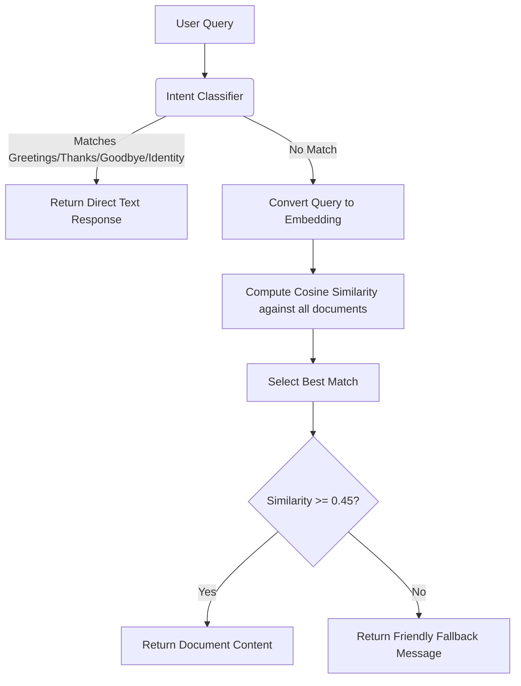

# SRMINFO: AI-Powered College Information Assistant

SRMINFO is a production-ready, AI-powered college information assistant designed to answer student queries about admissions, placements, academic regulations, scholarships, departments, hostels, transport, and events. 

It utilizes a hybrid search pipeline: rule-based intent classification for conversational phrases (greetings, thanks, goodbye, identity) and semantic search powered by sentence-transformers (`all-MiniLM-L6-v2`) for rich, contextual knowledge retrieval over a structured folder-based knowledge base.

---

## 🌟 Architecture & Tech Stack

- **Frontend**: Next.js (App Router), Tailwind CSS (v4), React, Lucide Icons, and LocalStorage for chat history.
- **Backend**: FastAPI, Python 3.11+, and Uvicorn.
- **Embedding Model**: `sentence-transformers/all-MiniLM-L6-v2` (maps queries and documents to 384-dimensional dense vectors).
- **Data Storage**: Folder-based JSON documents structured for easy migration to PostgreSQL + `pgvector`.
- **Hosting**: Vercel (Frontend) & Render (Backend).

---

## 📁 Project Structure

```text
SRMINFO/
├── knowledge_base/          # Structured JSON data documents
│   ├── admissions/          # Admission guidelines and fees
│   ├── placements/          # Placement data and statistics
│   ├── academics/           # Attendance policy and calendar
│   ├── scholarships/        # Available scholarships
│   ├── departments/         # Academic departments (CSE, IT, AIML)
│   ├── hostel/              # Hostel accommodation rules
│   ├── transport/           # Bus routes and guidelines
│   └── events/              # Annual events and fests
│
├── backend/                 # FastAPI Backend service
│   ├── models/              # Pydantic schema declarations
│   ├── routes/              # FastAPI router and handlers
│   ├── app.py               # Main application and lifespan configuration
│   ├── embeddings.py        # SentenceTransformer lazy loader
│   ├── intent_handler.py    # Pattern-matching intent classifier
│   ├── knowledge_loader.py  # Recursive JSON document loader
│   ├── search.py            # Cosine similarity semantic search
│   ├── requirements.txt     # Python packages
│   └── Dockerfile           # Docker configuration for production
│
├── frontend/                # Next.js React Frontend client
│   ├── app/                 # Next.js App Router (pages & styles)
│   │   ├── globals.css      # Styling & glassmorphic custom theme
│   │   ├── layout.tsx       # Root metadata and markup
│   │   └── page.tsx         # Chat interface UI
│   ├── services/            # API communication services
│   │   └── api.ts           # Fetch wrappers for endpoints
│   ├── package.json         # NPM packages
│   └── tsconfig.json        # TypeScript configuration
```

---

## 🚀 Local Development Setup

### 1. Backend Setup

Prerequisites: Python 3.11+ installed.

1. Navigate to the backend directory:
   ```bash
   cd backend
   ```
2. Create and activate a virtual environment:
   ```bash
   python -m venv venv
   # On Windows (PowerShell):
   .\venv\Scripts\Activate.ps1
   # On macOS/Linux:
   source venv/bin/activate
   ```
3. Install dependencies:
   ```bash
   pip install -r requirements.txt
   ```
4. Run the application locally:
   ```bash
   python -m uvicorn app:app --reload
   ```
   The backend will be running at `http://localhost:8000`. On first run, it will automatically download the `all-MiniLM-L6-v2` model weights (~90MB).

---

### 2. Frontend Setup

Prerequisites: Node.js v18+ and npm installed.

1. Navigate to the frontend directory:
   ```bash
   cd frontend
   ```
2. Install dependencies:
   ```bash
   npm install
   ```
3. Set environment variables:
   Create a `.env.local` file in the `frontend/` directory:
   ```env
   NEXT_PUBLIC_API_URL=http://localhost:8000
   ```
4. Run the development server:
   ```bash
   npm run dev
   ```
   The client will run on `http://localhost:3000`. Open it in your browser.

---

## 📡 API Endpoints

### 1. Send Chat Message
* **Endpoint**: `POST /chat`
* **Request Body**:
  ```json
  {
    "message": "What is the fee structure for CSE?"
  }
  ```
* **Response Body**:
  ```json
  {
    "answer": "The annual tuition fee for engineering programs..."
  }
  ```

### 2. Live Health Status
* **Endpoint**: `GET /health`
* **Response Body**:
  ```json
  {
    "status": "healthy"
  }
  ```

### 3. Reload Knowledge Base (Admin)
* **Endpoint**: `POST /reload-knowledge`
* **Description**: Recursively rescans the `knowledge_base` folder and updates search embeddings dynamically without restarting the server.
* **Response Body**:
  ```json
  {
    "status": "success",
    "message": "Knowledge base successfully reloaded and embeddings updated.",
    "document_count": 14
  }
  ```

---

## 🎯 Search Pipeline Flow



---

## 🌐 Production Deployment

### 1. Backend Deployment (Render)

Render supports Docker deployments. We can deploy using the provided `backend/Dockerfile`.

1. Log in to **Render** (render.com).
2. Create a new **Web Service** and connect your Github repository.
3. In the configuration:
   - **Runtime**: `Docker`
   - **Dockerfile Path**: `backend/Dockerfile`
   - **Docker Build Context**: Leave as root (repo root `.`), so the docker build can copy both `backend/` and `knowledge_base/` folders.
4. Render will build and deploy the container. Ensure you use the free or starter tier.

---

### 2. Frontend Deployment (Vercel)

Vercel is the native platform for Next.js and is free for personal projects.

1. Log in to **Vercel** (vercel.com).
2. Click **Add New** -> **Project** and import your Github repository.
3. In the settings:
   - **Framework Preset**: `Next.js`
   - **Root Directory**: `frontend`
   - **Environment Variables**: Add `NEXT_PUBLIC_API_URL` set to your Render backend URL (e.g. `https://srminfo-backend.onrender.com`).
4. Click **Deploy**. Vercel will build and serve your Next.js application.
